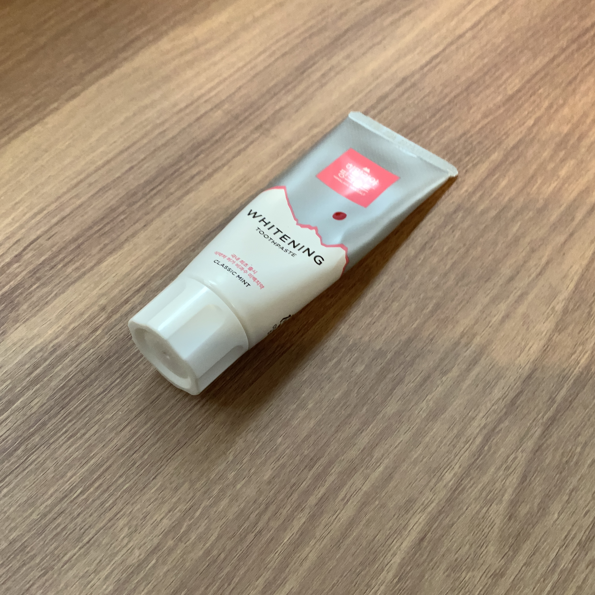
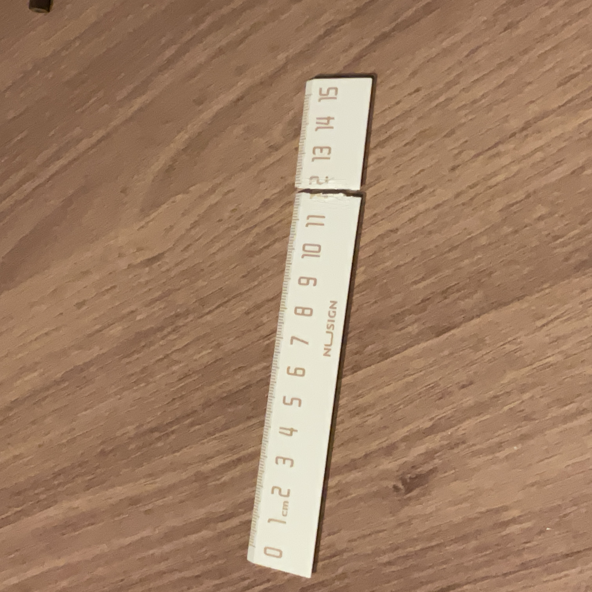

# AISystem-FinalProject-2402

This repository provides implementations of both few-shot and zero-shot anomaly detection using CLIP embeddings.

## Project Structure
```
AISystem-2402
├── fewshot-clip/
├── zeroshot-clip/
├── .gitignore
├── LICENSE
└── README.md
```

## Dataset Structure

**Training Dataset**
```
└──── ./train
    ├──── {class_name}/
    |   ├──── 0000.jpg
    |   ├──── ...
    |   └──── 0000.jpg
    ├──── {class_name}/
    |   ├──── 0000.jpg
    |   ├──── ...
    |   └──── 0000.jpg
```

**Test (Validation) Dataset**
```
└──── ./test
    ├──── anomaly/
    |   ├──── 0000.jpg
    |   ├──── ...
    |   └──── 0000.jpg
    ├──── normal/
    |   ├──── 0000.jpg
    |   ├──── ...
    |   └──── 0000.jpg
    
```

The dataset for anomaly detection is organized to facilitate both few-shot and zero-shot approaches with CLIP embeddings.

### Dataset Download
 Dataset can be downloaded [here](https://drive.google.com/file/d/1jdBVI93zKGfryAJ7FqUnl9z6n3n3Dgk9/view?usp=sharing).

### Dataset Organization
**For Final Project**
- **Training Data**: 10 classes (excluding the 6 classes from the preliminary competition), 5 normal images per class.
- **Validation Data**: No validation dataset will be given.


> Each class within the anomaly dataset contains at least one example of an anomaly, such as dots, cuts, or other class-specific defects like below. This design encourages exploration of anomaly detection within constrained data conditions.


<p align="center">
  
  
</p>

## Getting Started

1. Clone the Repository
```
git clone https://github.com/PiLab-CAU/AISystem-2402.git
```

2. Set up the Conda Environment
```
conda create -n cauclip python=3.xx
```
> The Recommended Python version is 3.8 or above :wink:

```
conda activate cauclip
```

3. Navigate to the Cloned Folder
```
cd AISystem-2402
```

4. Install Dependencies
```
pip install -r requirements.txt
```

Once the dependencies are installed, we are ready to detect anomalies! :grinning:

## Run Sample Code
### Fewshot-CLIP
To run the sample code for Few-Shot CLIP Embedding, execute:

```
python fewshot-clip/main.py
```

### Zeroshot-CLIP
To run the sample code for Zero-Shot CLIP Embedding, execute:

```
python zeroshot-clip/main.py
```

## Getting started with Docker
### Install Docker
Download and install Docker Desktop from the [Docker official Website](https://www.docker.com/products/docker-desktop/).

### Building the Docker Image
Use the following Dockerfile as a reference to ensure compatibility with the evaluation environment.
```Dockerfile
FROM python:3.10-slim

# Set working directory
WORKDIR /workspace

# Copy requirements file and install dependencies
COPY requirements.txt /workspace/
RUN pip install --upgrade pip
RUN pip install --no-cache-dir -r requirements.txt

# Copy project files
COPY . /workspace/
```

### Test the Docker Environment Locally
Before submission, students must test their code in the provided Docker environment to ensure it works correctly.

1. Build the Docker Image.
    ```bash
    docker build -t <name> .
    ```

2. Run Docker Container.
    ```
    docker run --rm -it \
        <name> \
        python main.py \ 
        --output_dir /workspace/results
    ```

## Submission Guidelines

### Required Files
Students must submit the Docker image with the followings:
1. Trained model file(best_model.pth) if using Few-Shot CLIP.
2. Inference script or any other files required for evaluation.
3. A requirements.txt file listing any additional Python dependencies.

#### Docker image Submission Format
```
submission_{student_number}.tar
├── model.pth (Few-Shot only)
├── main.py (or any other files required for evaluation)
└── requirements.txt
```
#### Save Docker image
```
docker save -o <submission_{student_number}>.tar
```

### Submissions details
#### Github Pull Request

### Leaderboard Updates
The leaderboard will be updated once daily at midnight based on the lasted evaluations.

## Performance Summary
The Performance of sample codes is shown in the tables below.


## Few-Shot CLIP
| Metric                    | Value                  |
|---------------------------|------------------------|
| **Overall Test Accuracy** | 50.00%                |
| **Total Time Taken**      | 2152.34 seconds         |
| **Average Time per Image** | 0.5381 seconds       |

#### Inference Details
| Class   | Correct | Total | Accuracy | Normal Similarity | Anomaly Similarity |
|---------|---------|-------|----------|-------------------|--------------------|
| Normal  | 2000      | 2000    | 100.00%  | -                | -                 |
| Anomaly | 0       | 2000    | 0.00%    | -                | -                 |

---

## Zero-Shot CLIP

| Metric                       | Value                  |
|------------------------------|------------------------|
| **Total Images**             | 4000                     |
| **Correct Predictions**      | 2026                     |
| **Overall Accuracy**         | 50.65%                 |

#### Class-Specific Performance

| Class     | Total | Correct | Incorrect | Accuracy | Avg Anomaly Score | Avg Normal Similarity | Avg Anomaly Similarity |
|-----------|-------|---------|-----------|----------|-------------------|-----------------------|------------------------|
| **Normal** | 2000    | 1364      | 636         | 68.20%  | 0.223            | 0.899                 | 0.676                  |
| **Anomaly** | 2000    | 662      | 1338        | 33.10%   | 0.230            | 0.878                 | 0.648                  |


*Metrics saved in `./results/metrics_{datetime}_{time}.json`. Results can be found in the `./results` directory.*


## Leaderboard

The leaderboard is updated **daily at midnight (00:00 KST)**.  
Ensure your submissions are finalized by **23:59 KST** to be included in the next update.


| Rank | Name             | Overall Score | Submission Count | Submission Date     |
|------|------------------|---------------|------------------|---------------------|
| 1    | zxcv3296    | 60.32%        | 1                | 2024-12-06 12:09 |
| 2    | **Baseline Model 2**  | **55.15%**    | 1                | 2024-12-13 17:10  |
| 3    | nshuhsn  | 55.07%     | 1                | 2024-12-13 13:06  |
| 4    | sumin819 | 52.25%      | 1                | 2024-12-14 13:37  |
| 5    | burugi  | 52.18%      | 1                | 2024-12-12 20:07  |
| 6    | **Baseline Model 1**  | **50.65%**      | 1                | - |
| 7   | koallako   | 50.25%        | 1                | 2024-12-13 23:54 |
| 8   | vavarier   | 50.18%        | 1                | 2024-12-12 14:33 |
| 9   | malinakmichal   | 44.62%        | 1                | 2024-12-14 23:31 |


## Further Information
For additional details on each module, check out the specific README files:

- [Few-Shot CLIP](../fewshot-clip/README.md) 

- [Zero-Shot CLIP](../zeroshot-clip/README.md)

## License

[](https://opensource.org/licenses/MIT)

This project is licensed under the MIT License - see the [LICENSE](./LICENSE) file for details.

## Contact

For questions or further information, please contact [leessoit@gmail.com](mailto:leessoit@gmail.com) or use the [issue tab](https://github.com/PiLab-CAU/AISystem-2402/issues) to report any problems or suggestions.
